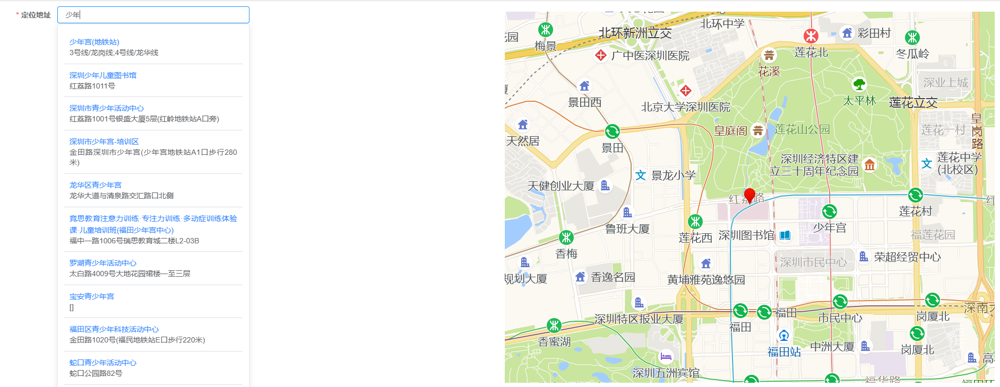

# 多有借鉴
  多有参考和借鉴
# 组件
## year-picker
element-ui DatePicker 年范围的选择组件，参数类同
```
      <year-picker
        v-model="yearRange"
        value-format="yyyy"
        type="yearrange"
        range-separator="-"
        start-placeholder="开始时间"
        end-placeholder="结束时间"
      />
      yearRange: ['2024',2024]
```
### openlayer-amap
使用高德的地址地址逆解析与关键字查询，
效果如下
